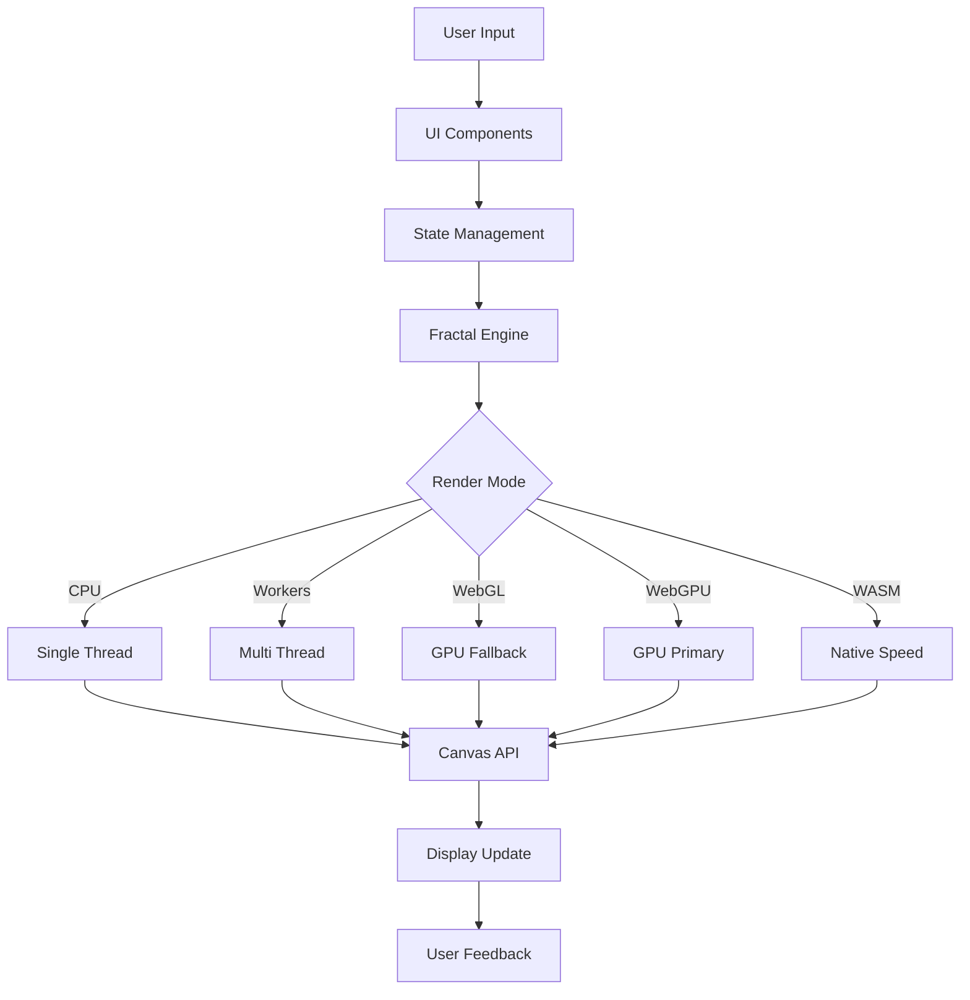

# アーキテクチャ設計書

## 1. システム概要

### 1.1 システム構成
Fractal Explorerは、フロントエンド単体のSPA (Single Page Application) として設計されたWebアプリケーションです。
最新のWeb技術を活用し、高性能なフラクタル計算・描画機能を提供します。

### 1.2 技術的特徴
- **TypeScript完全対応**: 型安全性の徹底
- **マルチレンダリング**: CPU/WebGL/WebGPU/WASM対応
- **ハイブリッドアーキテクチャ**: Astro SSG + React islands
- **モダンCSS**: Tailwind CSS + CSS Grid/Flexbox
- **高速ビルド**: Astro + Vite + Biome
- **SEO最適化**: 静的サイト生成 + 動的コンテンツ

## 2. アーキテクチャ概観

### 2.1 レイヤード・アーキテクチャ

```
┌─────────────────────────────────────────────────────────────┐
│                    Presentation Layer                       │
│  React Components, UI, Event Handlers, Routing            │
├─────────────────────────────────────────────────────────────┤
│                   Application Layer                        │
│  Hooks, State Management, Business Logic                  │
├─────────────────────────────────────────────────────────────┤
│                     Domain Layer                           │
│  Fractal Algorithms, Mathematical Calculations            │
├─────────────────────────────────────────────────────────────┤
│                 Infrastructure Layer                       │
│  Canvas API, WebGPU, WebGL, Web Workers, WASM            │
└─────────────────────────────────────────────────────────────┘
```

### 2.2 モジュール構成

```typescript
// Core Modules
├── Fractal Engine         // フラクタル計算エンジン
├── Renderer Manager       // レンダリング管理
├── Worker Manager         // 並列処理制御
├── GPU Handler           // GPU加速処理
└── State Manager         // アプリケーション状態

// UI Modules  
├── Astro Pages           // 静的ページ生成
├── React Islands         // インタラクティブコンポーネント
├── Component System      // 共通コンポーネント
├── Theme System          // Tailwind テーマ
└── Layout System         // レスポンシブレイアウト
```

## 3. データフロー設計

### 3.1 全体データフロー



### 3.2 状態管理フロー

```typescript
// State Flow Pattern
interface AppState {
  fractal: FractalState;
  ui: UIState;
  performance: PerformanceState;
}

interface FractalState {
  type: FractalType;
  params: FractalParams;
  viewport: ViewportState;
  renderMode: RenderMode;
}

interface UIState {
  isLoading: boolean;
  progress: number;
  error: Error | null;
  sidebarOpen: boolean;
}

interface PerformanceState {
  fps: number;
  renderTime: number;
  memoryUsage: number;
  activeWorkers: number;
}
```

## 4. コンポーネント設計

### 4.1 アーキテクチャ階層

```
Astro Site
├── Static Pages (SSG)
│   ├── Layout.astro
│   │   ├── Header.astro
│   │   │   ├── Navigation.astro
│   │   │   └── ThemeToggle.astro
│   │   ├── Main.astro
│   │   └── Footer.astro
│   ├── index.astro (Home)
│   ├── gallery.astro
│   ├── about.astro
│   └── fractals/
│       ├── mandelbrot.astro
│       ├── julia.astro
│       └── sierpinski.astro
└── React Islands (Interactive)
    ├── FractalViewer.tsx
    │   ├── Canvas.tsx
    │   ├── Overlay.tsx
    │   └── Controls.tsx
    └── Sidebar.tsx
        ├── ParameterPanel.tsx
        ├── ColorPalette.tsx
        └── PresetManager.tsx
```

### 4.2 コンポーネント責務

#### 4.2.1 Presentation Components
```typescript
// 純粋なUIコンポーネント（状態を持たない）
interface PresentationComponent {
  props: ReadonlyProps;
  render(): JSX.Element;
}

// 例: Button, Slider, Card等
const Button: React.FC<ButtonProps> = ({ children, onClick, variant }) => {
  return (
    <button 
      className={getButtonClass(variant)}
      onClick={onClick}
    >
      {children}
    </button>
  );
};
```

#### 4.2.2 Container Components
```typescript
// ビジネスロジックと状態を管理
interface ContainerComponent {
  state: ComponentState;
  actions: ComponentActions;
  render(): JSX.Element;
}

// 例: FractalViewer, ControlPanel等
const FractalViewer: React.FC<Props> = ({ fractalType }) => {
  const { render, isRendering, progress } = useFractalRenderer(fractalType);
  const { params, updateParams } = useFractalParams();
  
  return (
    <FractalCanvas 
      onRender={render}
      isRendering={isRendering}
      progress={progress}
    />
  );
};
```

## 5. レンダリングシステム

### 5.1 レンダリング戦略

```typescript
interface RenderingStrategy {
  readonly name: RenderMode;
  readonly priority: number;
  isSupported(): boolean;
  render(params: FractalParams): Promise<ImageData>;
}

class RenderingManager {
  private strategies: RenderingStrategy[] = [
    new WebGPURenderer(),     // 最高性能
    new WebGLRenderer(),      // GPU フォールバック
    new WASMRenderer(),       // ネイティブ速度
    new WorkerRenderer(),     // 並列CPU
    new CPURenderer()         // 基本実装
  ];

  async render(params: FractalParams): Promise<ImageData> {
    const strategy = this.selectBestStrategy();
    return await strategy.render(params);
  }

  private selectBestStrategy(): RenderingStrategy {
    return this.strategies
      .filter(s => s.isSupported())
      .sort((a, b) => b.priority - a.priority)[0];
  }
}
```

### 5.2 WebGPU実装

```typescript
class WebGPURenderer implements RenderingStrategy {
  private device: GPUDevice;
  private pipeline: GPUComputePipeline;
  private bindGroup: GPUBindGroup;

  async render(params: FractalParams): Promise<ImageData> {
    // 1. パラメータをGPUバッファに転送
    const paramsBuffer = this.createParamsBuffer(params);
    
    // 2. コンピュートシェーダー実行
    const commandEncoder = this.device.createCommandEncoder();
    const computePass = commandEncoder.beginComputePass();
    
    computePass.setPipeline(this.pipeline);
    computePass.setBindGroup(0, this.bindGroup);
    computePass.dispatchWorkgroups(
      Math.ceil(params.width / 8),
      Math.ceil(params.height / 8)
    );
    computePass.end();

    // 3. 結果をCPUに読み戻し
    this.device.queue.submit([commandEncoder.finish()]);
    return await this.readbackResult();
  }
}
```

### 5.3 Web Workers実装

```typescript
class WorkerRenderer implements RenderingStrategy {
  private workers: Worker[] = [];
  private workerCount: number;

  constructor() {
    this.workerCount = navigator.hardwareConcurrency || 4;
    this.initializeWorkers();
  }

  async render(params: FractalParams): Promise<ImageData> {
    const tiles = this.divideTiles(params);
    const promises = tiles.map((tile, index) => 
      this.renderTile(tile, index % this.workerCount)
    );
    
    const results = await Promise.all(promises);
    return this.compositeResults(results, params);
  }

  private divideTiles(params: FractalParams): TileParams[] {
    const tileSize = 64;
    const tiles: TileParams[] = [];
    
    for (let y = 0; y < params.height; y += tileSize) {
      for (let x = 0; x < params.width; x += tileSize) {
        tiles.push({
          ...params,
          offsetX: x,
          offsetY: y,
          width: Math.min(tileSize, params.width - x),
          height: Math.min(tileSize, params.height - y)
        });
      }
    }
    
    return tiles;
  }
}
```

## 6. 状態管理設計

### 6.1 React状態管理パターン

```typescript
// Compound Component Pattern
const FractalExplorer = {
  Viewer: FractalViewer,
  Controls: ControlPanel,
  Palette: ColorPalette,
  Presets: PresetManager,
};

// 使用例
<FractalExplorer>
  <FractalExplorer.Viewer fractalType="mandelbrot" />
  <FractalExplorer.Controls />
  <FractalExplorer.Palette />
  <FractalExplorer.Presets />
</FractalExplorer>
```

### 6.2 カスタムフック設計

```typescript
// フラクタルレンダリング管理
const useFractalRenderer = (fractalType: FractalType) => {
  const [state, setState] = useState<RenderState>(initialState);
  const rendererRef = useRef<RenderingManager>();

  const render = useCallback(async (params: FractalParams) => {
    setState(prev => ({ ...prev, isRendering: true, progress: 0 }));
    
    try {
      const result = await rendererRef.current?.render(params);
      setState(prev => ({ ...prev, imageData: result, isRendering: false }));
    } catch (error) {
      setState(prev => ({ ...prev, error, isRendering: false }));
    }
  }, [fractalType]);

  return { ...state, render };
};

// ビューポート管理
const useViewport = () => {
  const [viewport, setViewport] = useState<ViewportState>(defaultViewport);

  const zoom = useCallback((factor: number, centerX?: number, centerY?: number) => {
    setViewport(prev => ({
      ...prev,
      zoom: prev.zoom * factor,
      centerX: centerX ?? prev.centerX,
      centerY: centerY ?? prev.centerY
    }));
  }, []);

  const pan = useCallback((deltaX: number, deltaY: number) => {
    setViewport(prev => ({
      ...prev,
      centerX: prev.centerX + deltaX / prev.zoom,
      centerY: prev.centerY + deltaY / prev.zoom
    }));
  }, []);

  return { viewport, zoom, pan, setViewport };
};
```

## 7. パフォーマンス最適化

### 7.1 React最適化戦略

```typescript
// メモ化戦略
const FractalViewer = React.memo<Props>(({ params, onRender }) => {
  // 重い計算をメモ化
  const colorPalette = useMemo(() => 
    generateColorPalette(params.colorScheme), 
    [params.colorScheme]
  );

  // コールバックの安定化
  const handleCanvasClick = useCallback((event: MouseEvent) => {
    const rect = canvasRef.current?.getBoundingClientRect();
    if (rect) {
      const x = event.clientX - rect.left;
      const y = event.clientY - rect.top;
      onPointClick?.(x, y);
    }
  }, [onPointClick]);

  return <canvas ref={canvasRef} onClick={handleCanvasClick} />;
}, (prevProps, nextProps) => {
  // 浅い比較では不十分な場合のカスタム比較
  return deepEqual(prevProps.params, nextProps.params);
});
```

### 7.2 レンダリング最適化

```typescript
// プログレッシブレンダリング
class ProgressiveRenderer {
  async render(params: FractalParams, onProgress: ProgressCallback): Promise<ImageData> {
    // 1. 低解像度プレビュー
    const previewParams = { ...params, width: params.width / 4, height: params.height / 4 };
    const preview = await this.renderLowRes(previewParams);
    onProgress(0.2, preview);

    // 2. 段階的品質向上
    for (let level = 1; level <= 4; level++) {
      const levelParams = { 
        ...params, 
        maxIterations: params.maxIterations * level / 4 
      };
      const result = await this.renderLevel(levelParams);
      onProgress(0.2 + (level * 0.2), result);
    }

    // 3. 最終品質
    return await this.renderFull(params);
  }
}
```

## 8. エラーハンドリング設計

### 8.1 エラー境界戦略

```typescript
// グローバルエラー境界
class GlobalErrorBoundary extends React.Component<Props, State> {
  static getDerivedStateFromError(error: Error): State {
    return {
      hasError: true,
      error,
      errorInfo: null
    };
  }

  componentDidCatch(error: Error, errorInfo: ErrorInfo) {
    // エラーログ収集
    this.logError(error, errorInfo);
    
    // 回復可能性チェック
    if (this.isRecoverable(error)) {
      this.attemptRecovery();
    }
  }

  render() {
    if (this.state.hasError) {
      return <ErrorFallback error={this.state.error} />;
    }
    return this.props.children;
  }
}

// 機能別エラー境界
const FractalErrorBoundary: React.FC<Props> = ({ children }) => {
  return (
    <ErrorBoundary
      FallbackComponent={FractalErrorFallback}
      onError={(error, errorInfo) => {
        console.error('Fractal rendering error:', error);
        // フラクタル固有のエラー処理
      }}
    >
      {children}
    </ErrorBoundary>
  );
};
```

### 8.2 非同期エラー処理

```typescript
// Promise エラーハンドリング
const useAsyncError = () => {
  const [error, setError] = useState<Error | null>(null);

  const executeAsync = useCallback(async <T>(
    asyncFn: () => Promise<T>,
    errorHandler?: (error: Error) => void
  ): Promise<T | null> => {
    try {
      setError(null);
      return await asyncFn();
    } catch (err) {
      const error = err instanceof Error ? err : new Error('Unknown error');
      setError(error);
      errorHandler?.(error);
      return null;
    }
  }, []);

  return { error, executeAsync, clearError: () => setError(null) };
};
```

## 9. テスト戦略

### 9.1 テストピラミッド

```
    ┌─────────────────┐
    │   E2E Tests     │ ← Cypress / Playwright
    │   (少数)        │
    ├─────────────────┤
    │ Integration     │ ← React Testing Library
    │ Tests (中程度)  │
    ├─────────────────┤
    │ Unit Tests      │ ← Jest / Vitest
    │ (多数)          │
    └─────────────────┘
```

### 9.2 テスト実装例

```typescript
// Unit Test: フラクタル計算
describe('MandelbrotSet', () => {
  const mandelbrot = new MandelbrotSet();

  test('should correctly identify points in the set', () => {
    // Origin point should be in the set
    expect(mandelbrot.isInSet(0, 0, 100)).toBe(true);
    
    // Point far from origin should not be in the set
    expect(mandelbrot.isInSet(10, 10, 100)).toBe(false);
  });

  test('should handle edge cases', () => {
    expect(() => mandelbrot.isInSet(NaN, 0, 100)).toThrow();
    expect(() => mandelbrot.isInSet(0, 0, -1)).toThrow();
  });
});

// Integration Test: コンポーネント
describe('FractalViewer', () => {
  test('should render mandelbrot set correctly', async () => {
    const onRender = jest.fn();
    
    render(
      <FractalViewer 
        fractalType="mandelbrot"
        params={defaultParams}
        onRender={onRender}
      />
    );

    await waitFor(() => {
      expect(screen.getByRole('img')).toBeInTheDocument();
    });

    expect(onRender).toHaveBeenCalledWith(
      expect.objectContaining({
        fractalType: 'mandelbrot',
        params: defaultParams
      })
    );
  });
});
```

## 10. デプロイメント設計

### 10.1 GitHub Pages デプロイ

```typescript
// astro.config.ts
export default defineConfig({
  site: 'https://your-username.github.io',
  base: '/Fractal-js/',
  integrations: [
    react(),
    tailwind(),
    sitemap()
  ],
  build: {
    assets: 'assets'
  },
  output: 'static',
  adapter: staticAdapter(),
  vite: {
    optimizeDeps: {
      exclude: ['@wasm/fractal-core']
    }
  }
});
```

### 10.2 CI/CD パイプライン

```yaml
# .github/workflows/deploy.yml
name: Deploy to GitHub Pages

on:
  push:
    branches: [ main ]

jobs:
  build-and-deploy:
    runs-on: ubuntu-latest
    steps:
      - uses: actions/checkout@v4
      
      - name: Setup Node.js
        uses: actions/setup-node@v4
        with:
          node-version: '20'
          cache: 'npm'
          
      - name: Install dependencies
        run: npm ci
        
      - name: Lint and type check
        run: |
          npm run lint
          npm run type-check
          
      - name: Build
        run: npm run build
        
      - name: Deploy to GitHub Pages
        uses: peaceiris/actions-gh-pages@v3
        with:
          github_token: ${{ secrets.GITHUB_TOKEN }}
          publish_dir: ./dist
```

## 11. 監視・メトリクス

### 11.1 パフォーマンス監視

```typescript
// Performance Monitor
class PerformanceMonitor {
  private metrics: PerformanceMetrics = {
    renderTime: [],
    fps: [],
    memoryUsage: [],
    gpuUtilization: []
  };

  startRender(): string {
    const id = `render-${Date.now()}`;
    performance.mark(`${id}-start`);
    return id;
  }

  endRender(id: string): number {
    performance.mark(`${id}-end`);
    performance.measure(id, `${id}-start`, `${id}-end`);
    
    const measure = performance.getEntriesByName(id)[0];
    this.metrics.renderTime.push(measure.duration);
    
    return measure.duration;
  }

  getAverageRenderTime(): number {
    const times = this.metrics.renderTime.slice(-100); // 直近100回
    return times.reduce((sum, time) => sum + time, 0) / times.length;
  }
}
```

---

*最終更新: 2024年12月*
*バージョン: 1.0* 